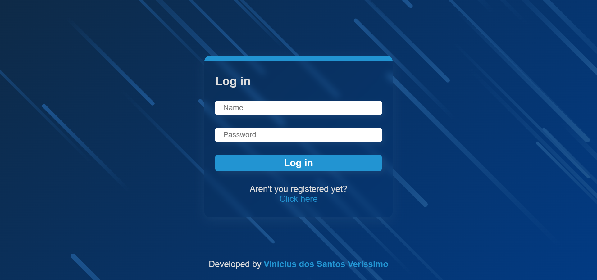

# User Login and Registration Application using React, Yup, React-Hook-Form in the front-end

## Overview

### Screenshot

## My proccess

### Built with

-   HTML5
-   CSS3
-   JavaScript
-   React
-   Axios
-   Styled-Components
-   React-Hook-Form

### How to use

Firstly, open the terminal and execute "yarn install" to install the dependencies used by the client-side.

To open the application on the browser, execute "yarn dev" on the terminal.

The aplication consumes an API on the address "http://localhost:4000", using the "/login" and "/user/cadaster" endpoints.

It uses the "Yup" library to validate the input fields, using a formatted schema, and "React-Hook-Form" to build the forms.

It also uses the "Axios" library to establish the communication with the API's endpoints, using the "POST" method of HTTP protocol.

By using two routes, with "React-Router-Dom" it was possible to create a form only to login and another one only to register a new user.

For styling, it was used the "Styled-Components" library to create a global style and the specific styles of each page and each component.

## Author

-   GitHub - Vinícius dos Santos Verissimo (https://github.com/viniciusdsv93)

-   Portfolio (https://viniciusdsv93.github.io/Portfolio/)
