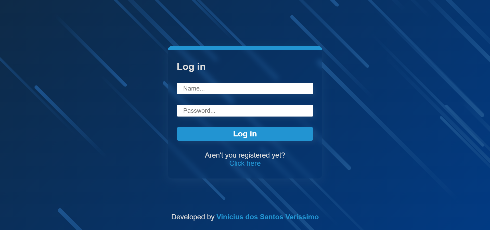

# Aplicação de Login e Cadastro de Usuários usando React, Yup, React-Hook-Form no front-end

## Visão Geral

### Screenshot

## Meu processo

### Construído com

-   HTML5
-   CSS3
-   JavaScript
-   React
-   Axios
-   Styled-Components
-   React-Hook-Form

### Como utilizar

Em primeiro lugar, abra o terminal e execute "yarn install" para instalar as dependências utilizadas pelo client-side.

Para abrir a aplicação no navegador, execute "yarn dev" no terminal.

A aplicação consome uma API no endereço "http://localhost:4000", nos endpoints "/login" e "/user/cadaster".

Ela utiliza a biblioteca "Yup" para validar os campos de input, usando um esquema de formatação, e a "React-Hook-Form" para construir os formulários.

Também utiliza a biblioteca "Axios" para estabelecer a comunicação com os endpoints da API, usando o método "POST" do protocolo HTTP.

Ao utilizar duas rotas, com o "React-Router-DOM", foi possível criar um formulário apenas para o login e outro somente para registrar um novo usuário.

Para estilização, foi usada a biblioteca "Styled-Components" para criar um estilo global e estilos específicos de cada página e componente.

## Autor

-   GitHub - Vinícius dos Santos Verissimo (https://github.com/viniciusdsv93)

-   Portfolio (https://viniciusdsv93.github.io/Portfolio/)
